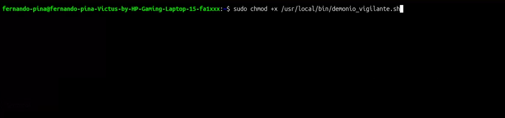
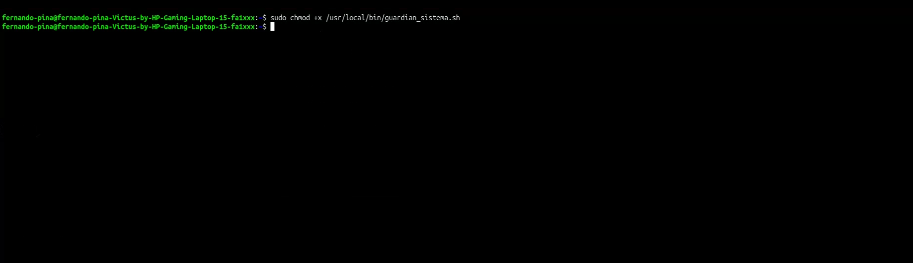
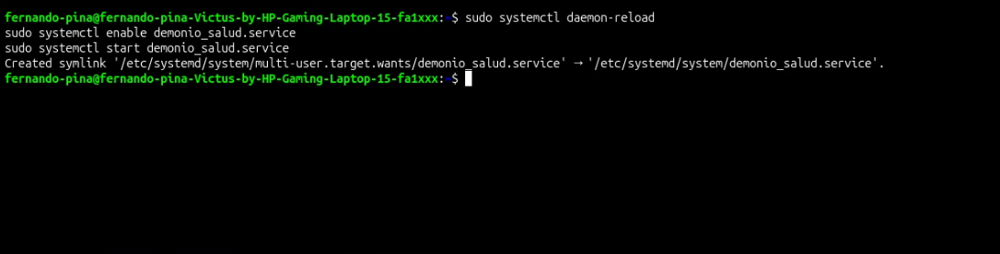
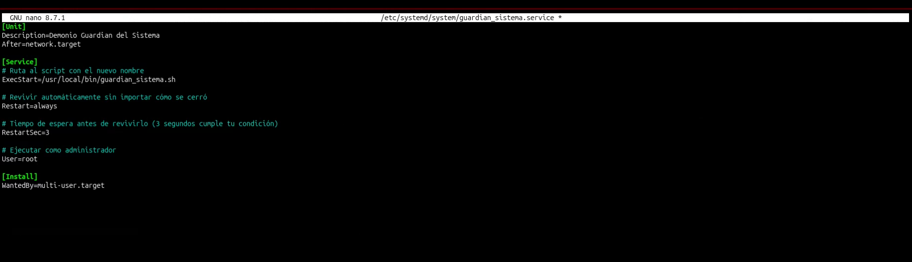
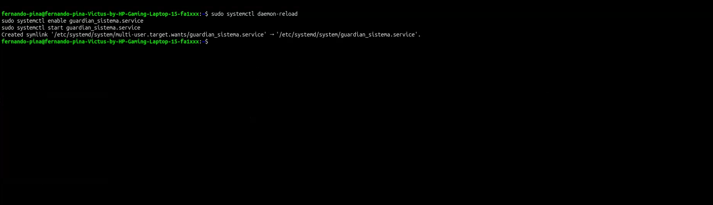
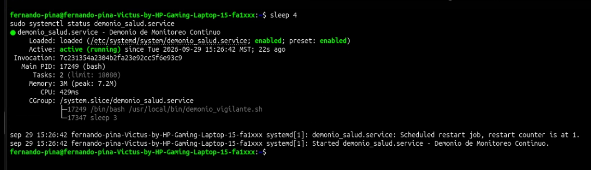
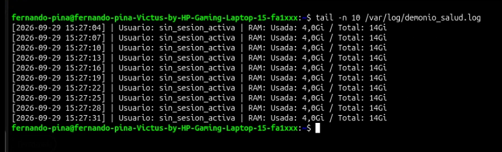
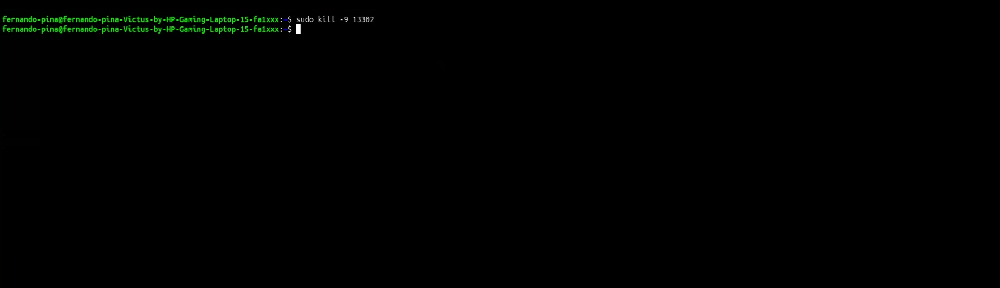
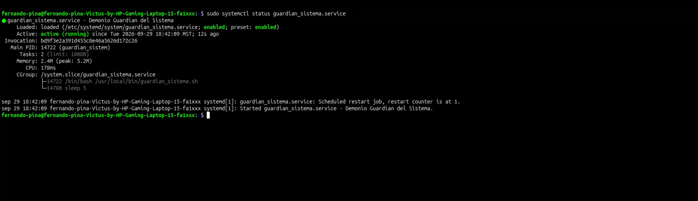

# 📌 Demonio de Monitoreo Persistente con Systemd

---

## 📖 Descripción
El objetivo de esta práctica es diseñar e implementar un servicio/demonio persistente en segundo plano administrado por **systemd**. El demonio se ejecuta continuamente en un ciclo de 5 segundos registrando en una bitácora la fecha/hora exacta con segundos, el número total de procesos activos y la memoria RAM disponible. El sistema cuenta con tolerancia a fallos, garantizando que ante un cierre forzado mediante el comando `kill -9`, el sistema operativo (`systemd`) lo reinicie automáticamente en menos de 5 segundos con un nuevo PID.

## 🎯 Objetivos de aprendizaje
Familiarizarse con la creación y administración de servicios del sistema en Linux mediante **systemd**. Aprender a estructurar scripts continuos en Bash con ciclos infinitos, escribir archivos de unidad `.service`, configurar directivas de reanimación automática (`Restart=always` y `RestartSec=3`), direccionar flujos de datos hacia archivos de log (`/var/log/monitordemonio.log`) y aplicar pruebas de resiliencia mediante la interrupción abrupta de procesos con señales del kernel.

## 💻 Material utilizado
- 💻 Laptop con el sistema operativo **Ubuntu Desktop** (Linux)
- ⚙️ Administrador de sistemas y servicios **systemd**

---

## 📄 Informe
- 📎 [Informe](Informe-demonio.pdf)

## 📸 Evidencias de la práctica
<table align="center">
  <tr>
    <td align="center">
       
      <i>1. Creación del script en Bash</i>
    </td>
    <td align="center">
       
      <i>2. Otorgando permisos de ejecución (chmod +x)</i>
    </td>
    <td align="center">
       
      <i>3. Archivo de unidad monitordemonio.service</i>
    </td>
  </tr>
  <tr>
    <td align="center">
       
      <i>4. Recarga de configuración (daemon-reload)</i>
    </td>
    <td align="center">
       
      <i>5. Habilitación e inicio del servicio</i>
    </td>
    <td align="center">
       
      <i>6. Estado activo del servicio (active running)</i>
    </td>
  </tr>
  <tr>
    <td align="center">
       
      <i>7. Salida de los logs en tiempo real (tail -f)</i>
    </td>
    <td align="center">
       
      <i>8. Consulta del PID inicial</i>
    </td>
    <td align="center">
       
      <i>9. Interrupción forzada con kill -9</i>
    </td>
  </tr>
  <tr>
    <td align="center" colspan="3">
       
      <i>10. Reanimación automática por systemd y asignación de nuevo PID</i>
    </td>
  </tr>
</table>

---

## 📝 Comandos
- ⌨️ [Comandos_demonio.md](Comandos/Comandos_demonio.md)

## 🎥 Video del funcionamiento
- 📄 [Readme](Vídeo/readme.txt)
- ▶️ [Ver video en YouTube](https://youtu.be/TU_ENLACE_AQUI)

---

## 💡 Conclusiones
La práctica permitió comprender el funcionamiento y la arquitectura de los demonios en entornos Linux modernos utilizando `systemd`. A diferencia de los programas ejecutados en terminales interactivas o mediante tareas programadas como `cron`, un servicio administrado por `systemd` garantiza supervisión continua en segundo plano. Se comprobó experimentalmente la condición de aprobación: al aplicar la directiva `Restart=always` con un temporizador `RestartSec=3`, el sistema operativo detecta la terminación abrupta del proceso provocada por `kill -9` y levanta automáticamente el demonio en menos de 5 segundos asignándole un nuevo PID, garantizando la alta disponibilidad del monitoreo.

## 📊 Resultados
- 📈 [Resultados](Resultados-demonio.pdf)
