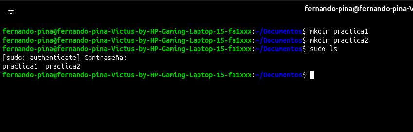
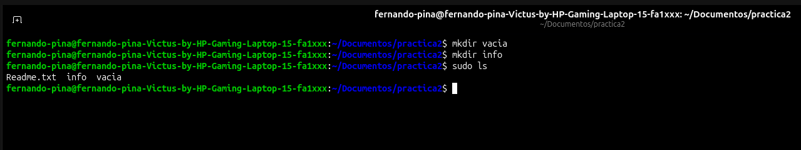
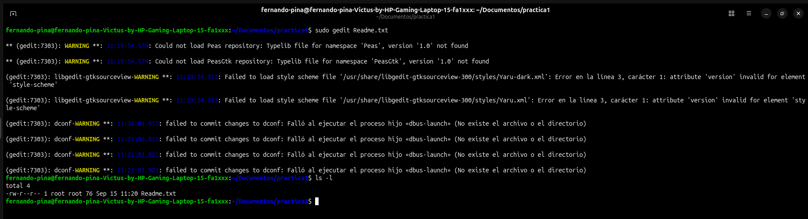
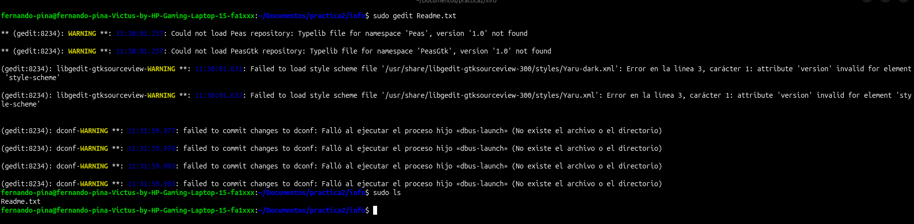
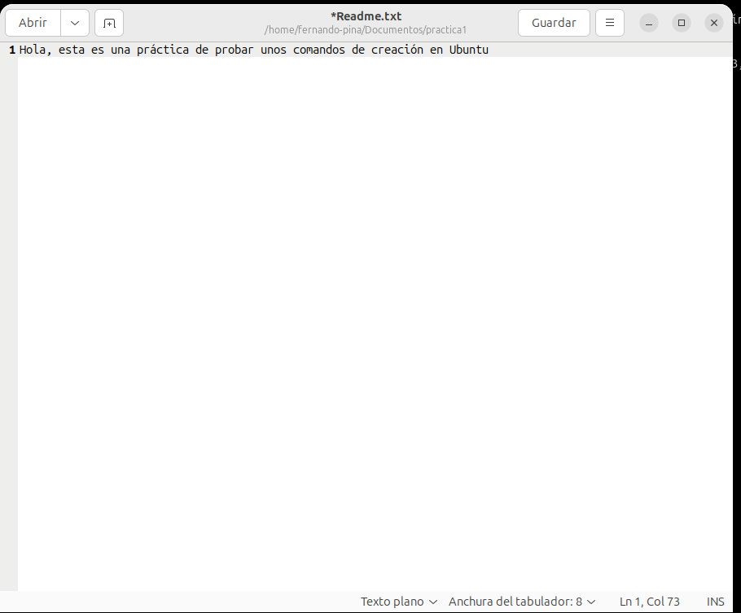
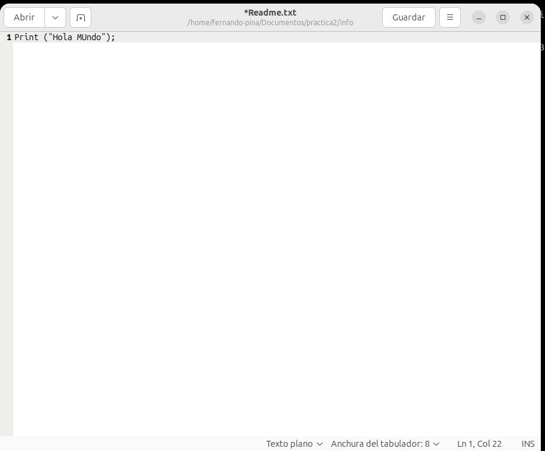
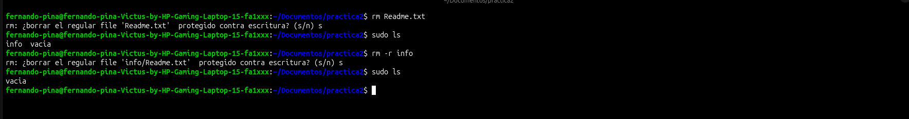
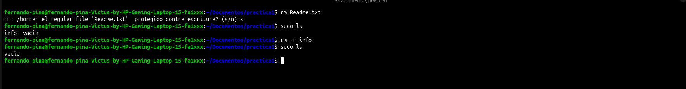

# 📌 Nombre del proyecto
**Comandos Copiar y Borrar en Ubuntu**

---

## 📖 Descripción
El objetivo de esta práctica es dominar los comandos fundamentales para la creación, gestión, duplicación y eliminación de archivos y carpetas directamente desde la terminal de Ubuntu.

## 🎯 Objetivos de aprendizaje
Familiarizarse con la administración de archivos y directorios en la consola de Ubuntu mediante la ejecución de comandos para crear (`mkdir`), editar (`gedit`), copiar (`cp`) y eliminar (`rm`) elementos. Esto permite entender cómo usar sus diferentes variaciones y parámetros para operar el sistema de manera rápida y directa, teniendo un control total sin depender de la interfaz gráfica.

## 💻 Material utilizado
- 💻 Laptop con el sistema operativo **Ubuntu**

---

## 📄 Informe
- 📎 [Informe.pdf](Informe/Comandos%20Copiar%20y%20Borrar.pdf)

## 📸 Evidencias de la práctica
<table align="center">
  <tr>
    <td align="center">
       
      <i>1. Creación de directorios (mkdir)</i>
    </td>
    <td align="center">
       
      <i>2. Verificación de carpetas</i>
    </td>
    <td align="center">
       
      <i>3. Abriendo editor (gedit)</i>
    </td>
  </tr>
  <tr>
    <td align="center">
       
      <i>4. Edición de texto</i>
    </td>
    <td align="center">
       
      <i>5. Archivo Readme creado</i>
    </td>
    <td align="center">
       
      <i>6. Contenido del Readme</i>
    </td>
  </tr>
  <tr>
    <td align="center">
       
      <i>7. Copiado de carpetas (cp -r)</i>
    </td>
    <td align="center">
       
      <i>8. Borrado de archivos (rm)</i>
    </td>
    <td align="center">
       
      <i>9. Verificación de borrado</i>
    </td>
  </tr>
</table>

---

## 📝 Comandos
- ⌨️ [Comandos.txt](Comandos/Comandos_Copiar_Borrar.md)

## 🎥 Video del funcionamiento
- 📄 [Readme](Vídeo/readme.txt)
- ▶️ [Ver video en YouTube](https://youtu.be/6_UBo93rzWk)

---

## 💡 Conclusiones
La práctica permitió reforzar la administración directa del sistema de archivos en Ubuntu. Se comprendió la potencia y responsabilidad al usar comandos de manipulación como `cp` y `rm`, destacando la importancia de aplicar los parámetros correctos (como `-r` para procesar carpetas completas). El uso de la terminal nos enseña que las acciones son inmediatas y definitivas —especialmente al eliminar con `rm -r`, ya que no existe una papelera de reciclaje—, lo que exige mayor precaución al teclear, pero a cambio ofrece una velocidad y un nivel de control muy superior al uso tradicional del ratón.

## 📊 Resultados
- 📈 [Resultados.pdf](Resultados/Resultados_Comandos_Copiar_Borrar.pdf)
